#PMSM电机控制理论部分学习报告  
>目录
>>01 控制结构
>>>前馈控制
>>>反馈控制
>>>级联控制
>>>电流环和速度环

>>02 FOC
>>>控制方法
>>>克拉克变换
>>>帕克变换
>>>SVPWM
>>>弱磁控制

##控制结构

###前馈控制
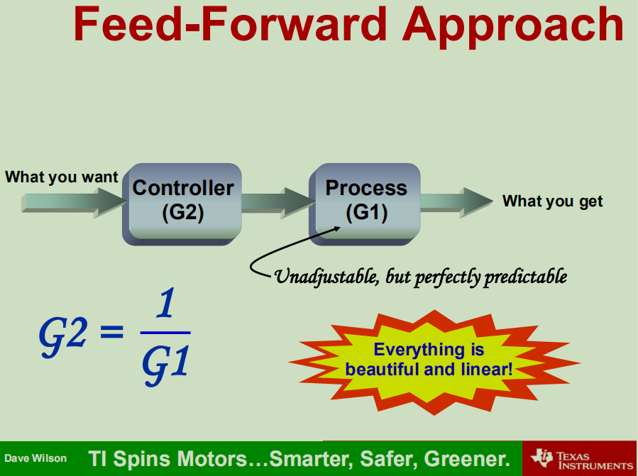
前馈控制根据期待值来控制输入，但是使用环境一般为线性控制；前馈控制不可调整但是预测性好。  
###反馈控制
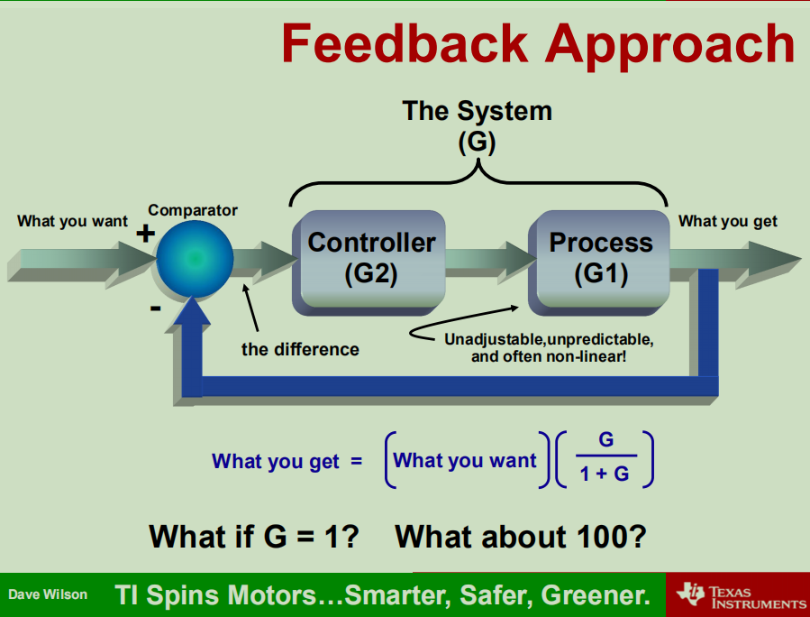
反馈控制根据期待值和反馈值进行控制，优点是控制效果较好，，但是系统是不可调整和预测的，而且由于反馈有相位差，高频率一般会带来高相移导致反馈效果减弱
###前馈与反馈的比较
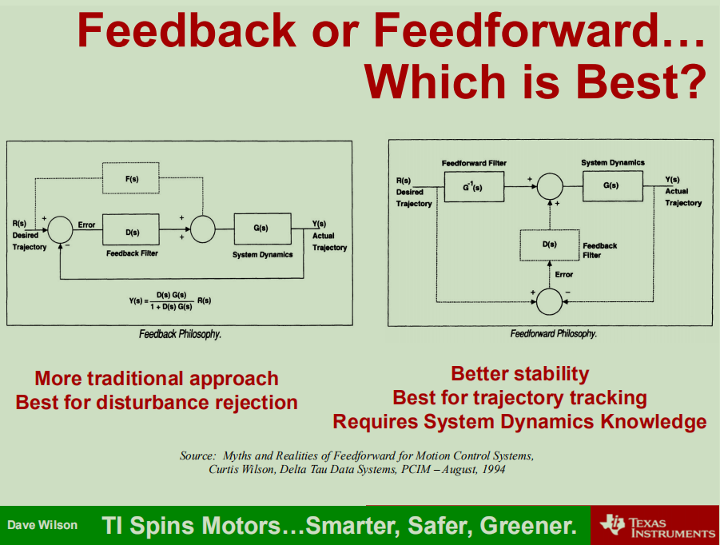

- 反馈控制更传统且最适合于抗干扰
- 前馈控制在稳定性和轨迹跟踪方面效果好但是需要系统的动力学知识  

###级联控制

上图的电机控制拓扑结构，可见控制器使用了3个串联的PI控制器（由于电机是感性电路，电流滞后电压，故使用PI控制）每个带宽根据前一级的上下限决定  

这是平行PI控制器，下图为通频带，可见此函数的极点由Ki和Kp控制，改变其任意一个参数，极点的横坐标都会移动，在特定频率下调节困难

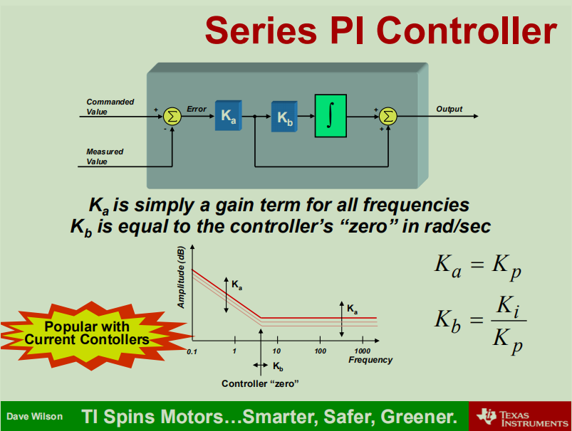
这是串行PI控制器及其通频带。可见其优点十分显著——调节只要Kb确定便可在特定频率下调节增益  

级联控制还有一个优点便是当加入后一级的控制器不影响前一级控制器的参数，如果使用传统的平行PID控制，当改变控制量的时候，pid的参数需要重新校准

###电流环和速度环

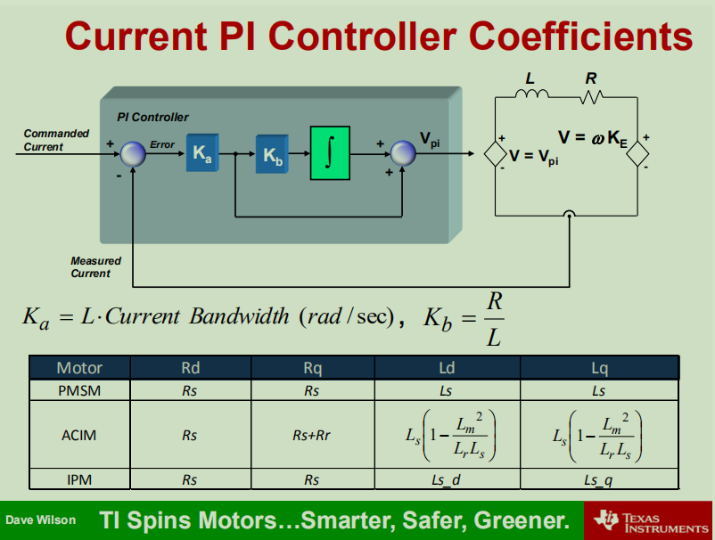
电流环：根据计算建模得出了电流PI控制器所需参数的值，增益Ka为电感x电流带宽，Kb频率系数为线圈电阻/电感，而不同电机类型的电路拓扑不一样，所需要的值也不一样。

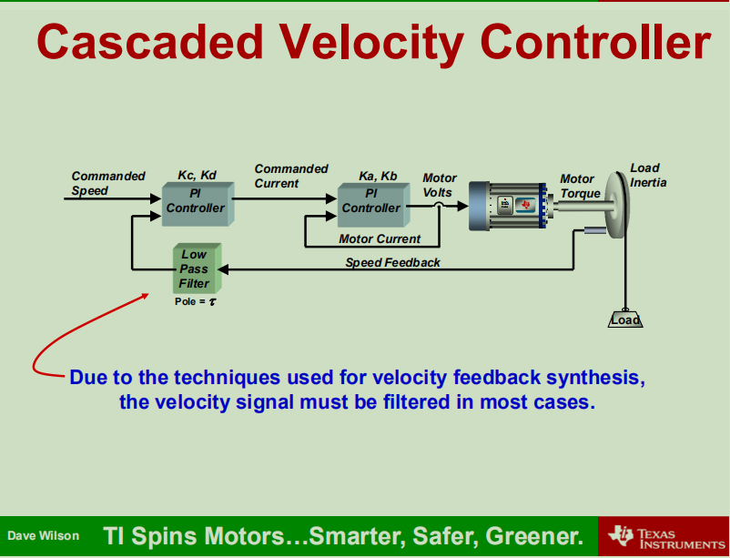
速度环：根据前文所讲到的串联PI控制，在电流环后串联一个速度控制器，反馈输入速度值，在大多数应用场景下，需要对速度信号进行低通滤波处理（如使用机械编码盘等）

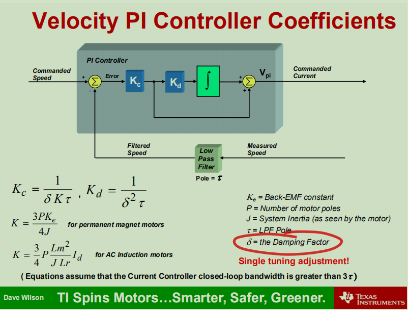
速度环的参数选取也是有讲究的，这里的Ke为反电动势常数，P为电机级数，J为系统转动惯量，τ为低通滤波器极点，δ为阻尼系数

####文章还介绍了一些积分器钳位技巧，这里不展示。

##Field Oriented Contrl场矢量控制

###控制方法

目标：电流磁通垂直于转子磁通，此时为最大扭矩

####1测量当前电机相电流 

无刷电机分为uwv三相，一般我们只需要2个电流传感器测量计算得出电机3个相的电流，但是工业上通过使用3个电流传感器来判断电机是否正常运行（是否漏电短路）

####2经过计算得出电流误差
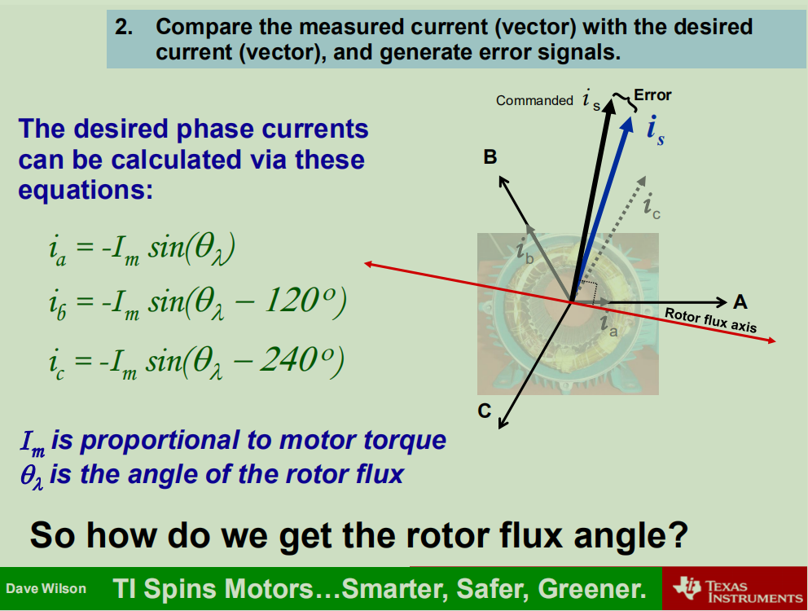
在极坐标系下通过向量加减法得出电流误差矢量

####3将误差信号传入反馈控制器产生矫正电压
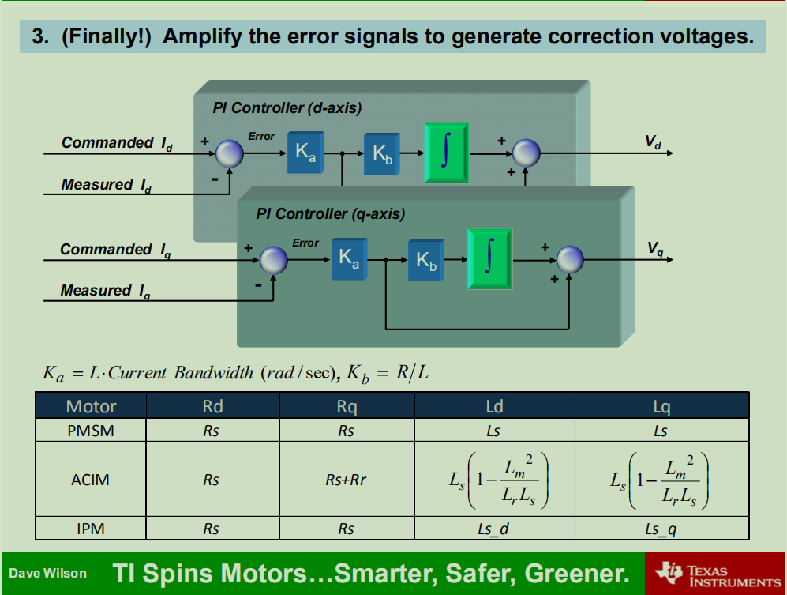

####4调制电压信号到电机
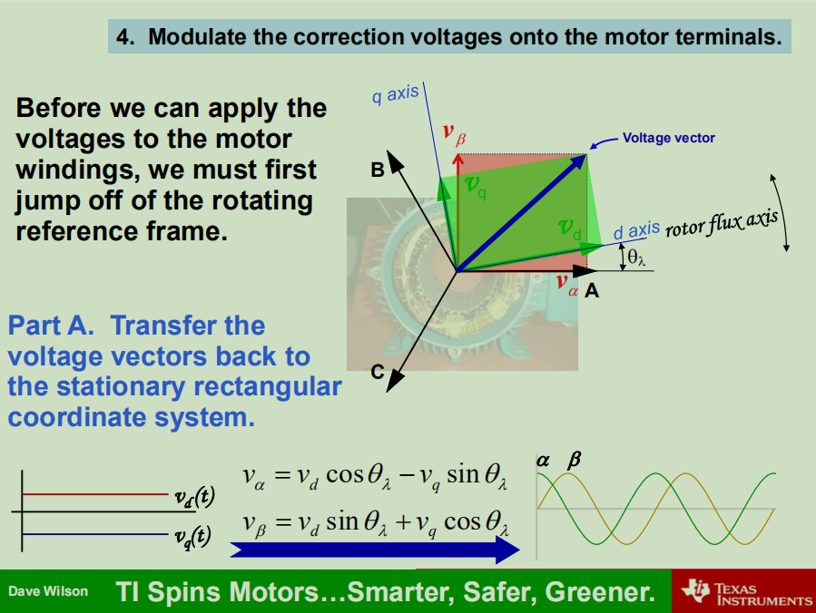

###克拉克变换
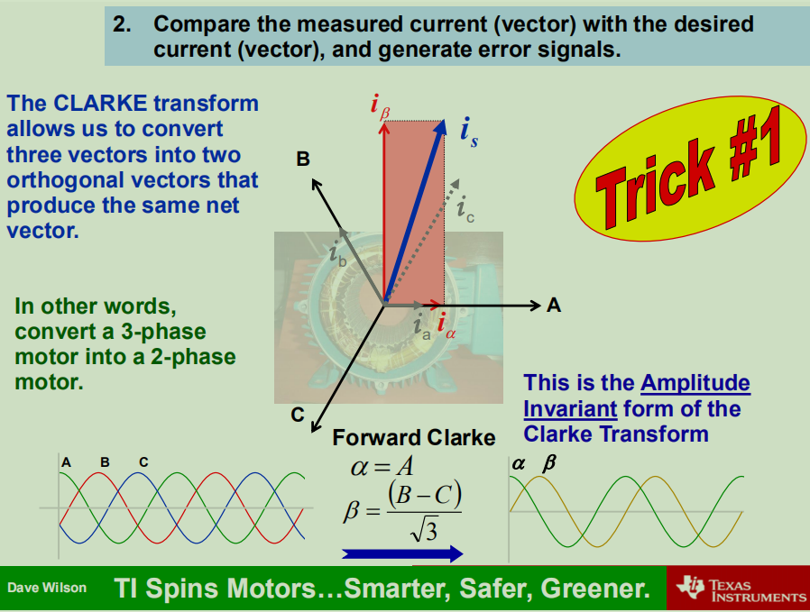
简单，通过极坐标变换把ab2路的相电流转换成αβ电流以简化计算

###帕克变换

转换到非惯性参考系中计算，把电流转换成转子磁通id，和定子电流iq
dq坐标系相对与定子来说是旋转的坐标系，转速的角速度和转子旋转的角速度相同，所以，相当于转子来说dq坐标系就是静止的坐标系而id和iq则是恒定不变的两个值，具体如下图所示；

根据物理结构，我们发现；
d轴方向与转子磁链方向重合，又叫直轴；
q轴方向与转子磁链方向垂直，又叫交轴；
d轴和q轴如下图所示；

###SVPWM-空间向量pwm调制

1.概述

SVPWM是近年发展的一种比较新颖的控制方法，是由三相功率逆变器的六个功率开关元件组成的特定开关模式产生的脉宽调制波，能够使输出电流波形尽可能接近于理想的正弦波形。空间电压矢量PWM与传统的正弦PWM不同，它是从三相输出电压的整体效果出发，着眼于如何使电机获得理想圆形磁链轨迹。SVPWM技术与SPWM相比较，绕组电流波形的谐波成分小，使得电机转矩脉动降低，旋转磁场更逼近圆形，而且使直流母线电压的利用率有了很大提高，且更易于实现数字化。

通俗化理解：把PMSM想象成两块同心的磁铁，两块磁铁是相吸的，因此当用手拨动外面的磁铁绕组圆心转动时，里面的磁铁也会跟着转动，这其实就是PMSM的本质了。PMSM的转子是永磁铁，定子是绕组，我们用电路控制定子绕组产生旋转的磁场，里面的转子磁铁就会跟着转动，这个磁场的大小最好恒定，不然一会儿大一会儿小，转子受到的牵引力也就一会儿大一会儿小，影响运动性能。好了，现在我们知道电机的本质是什么了。接下来，我们需要一个算法来控制定子绕组的输出，使其产生一个恒定的旋转磁场，这个算法就是SVPWM。

2.SVPWM基本原理

要得到一个恒定大小的旋转磁场，可以先来得到一个恒定大小的旋转电压矢量。如下图：

  

如果让绕组上的电压大小按照正弦规律变化呢？直接通交流电，就是正弦的呀，可不可以呢？驱动器的控制电路如下：

我们只能控制6个管子的开关而已，看来直接通交流电是不行了。于是我们只能控制PWM的占空比来等效正弦：

[SVPWM算法原理及详解](https://blog.csdn.net/qlexcel/article/details/74787619#comments)
[STM32 使用IQmath实现SVPWM](https://blog.csdn.net/u010632165/article/details/104042283)
###弱磁控制加速

1 弱磁扩速理论
  PMSM弱磁的思想来源于他励直流电动机的调磁控制。我们熟知，当他励直流电动机的端电压达到最大值之后，无法再用调压调速来提高转速，只有通过降低电动机的励磁电流，从而降低励磁磁通，实现在保证电压平衡的条件下，电机速度提升到额定转速以上。

  永磁同步电机的励磁磁通是由永磁体提供的，这个磁通是恒定不变的。这个时候如果我们想降低磁通强度，就只能通过增大定子电流的去磁分量来削弱气隙磁通，这样才能达到跟他励直流电动机的弱磁等效。

1.1 从公式层面来说明弱磁原理

  永磁同步电机弱磁控制的本质和规律可以电压平衡方程来说明

2 如何实现弱磁扩速
有了以上的概念，我们该如何在仿真中实现弱磁呢？采用双电流调节器的超前角弱磁控制。

2.1 超前角是什么？

定义：超前角 \beta   为两相旋转坐标系dq坐标系下，定子电流矢量超前q轴的电角度。 如下图所示

2.2 超前角弱磁的原理是什么？

当转速达到转折速度时，电流调节器仍然处于饱和状态，定子电压已经达到极限状态。如果我们此时通过电压反馈来调节超前角\beta 在到达额定转速后增大，直轴的去磁电流反向增大，交轴电流也随之减小，随着直轴去磁电流的增大，磁通减小。以此实现在不增加逆变器容量的情况下弱磁。

 

2.3 超前角控制框图

具体如何是现在simulink里面判断是否达到额定转速呢？

电流调节器的输出 ud 和 uq 作为弱磁调节器的输入量，并于逆变器所能输出的最大电压 Umax比较，二者的偏差作为弱磁环节的PI调节器的输入，PI调节器输出超前角\beta来调节 iq 和 id 的给定。

由于采用的时SVPWM调制，U_{max}=\tfrac{U_{dc}}{\sqrt{3}} ，此时有几种情况

1，当\sqrt{U_{d}^{2}+U_{q}^{2}}小于Umax时电压PI调节器正向饱和，此时超前角\beta为0，电机运行在恒转矩区

2，当\sqrt{U_{d}^{2}+U_{q}^{2}}大于Umax时电压PI调节器的输入值为负数，调节器开始退出饱和，输出的超前角为负，此时电机运行在弱磁区。

由公式可以看出，在电压达到最大时，要想再升高转速，就只能靠调节 id 和 iq 来实现了，这就是电机的弱磁运行方式。同时电机的电流也是由相应的限制的，增大 iq 的同时必须要减小 id，才能保持电流矢量的大小不变。一般是通过增大 id 来实现弱磁扩速的。
[弱磁控制(超前角弱磁)](https://blog.csdn.net/sy243772901/article/details/88077392)
