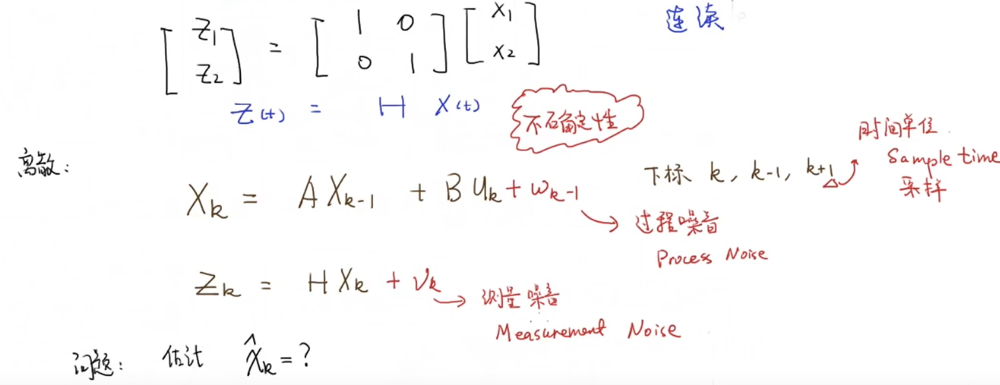
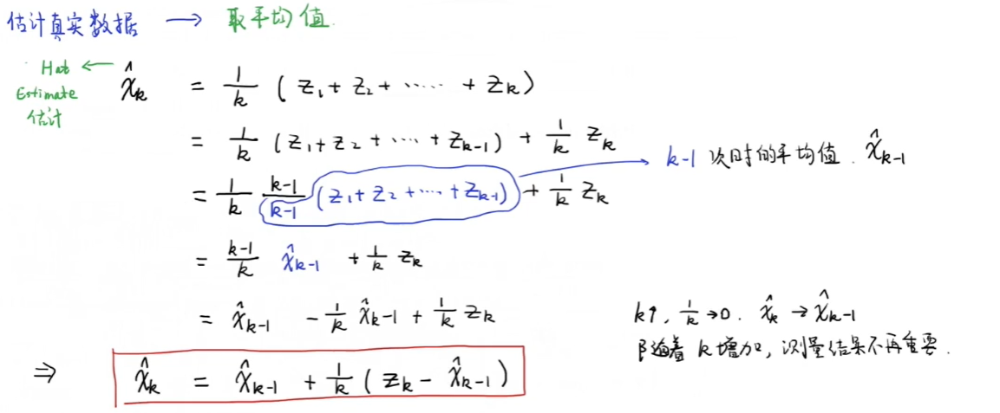
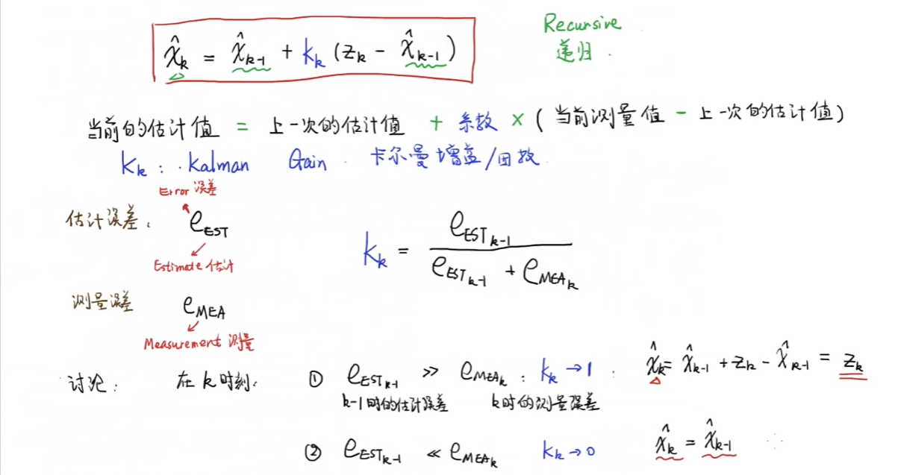
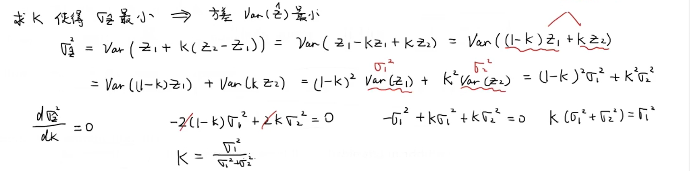
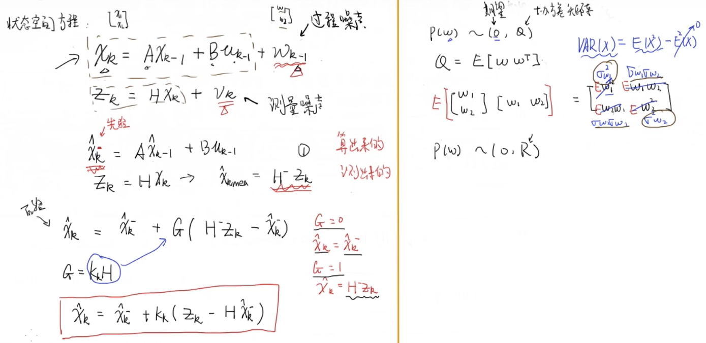
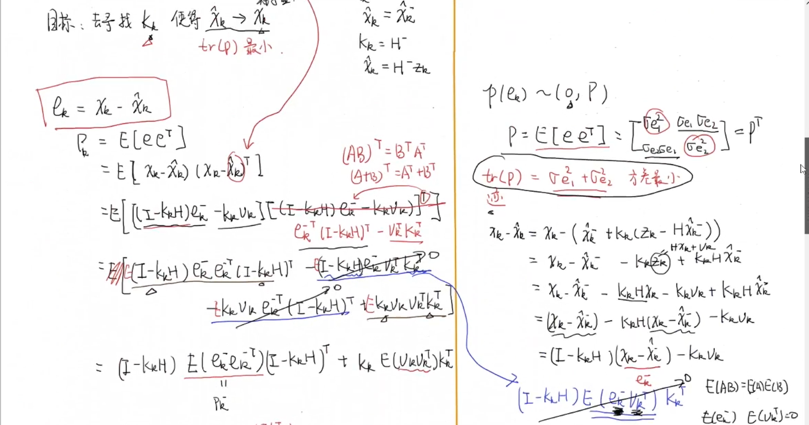
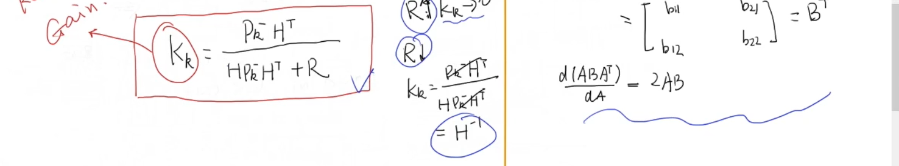
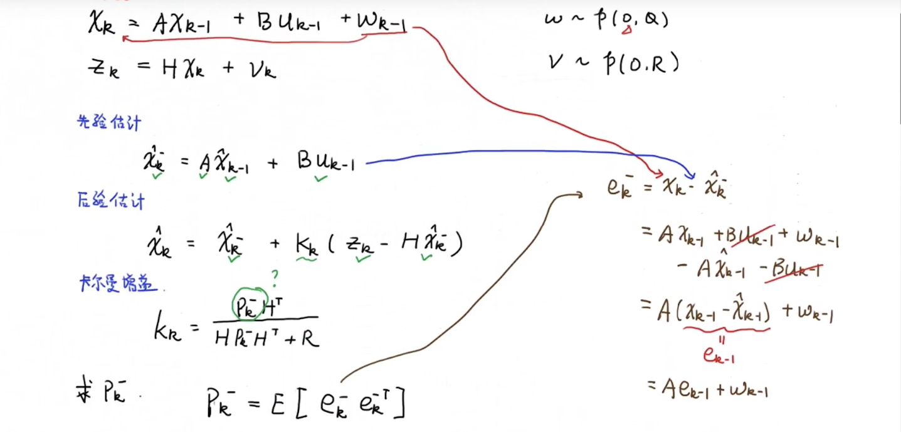
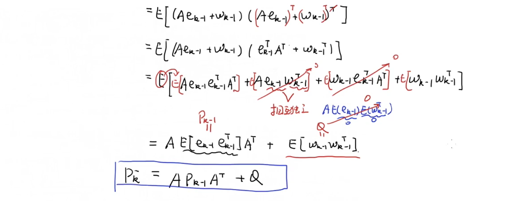
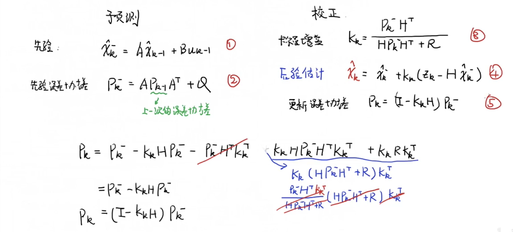

#一阶卡尔曼滤波  

刚刚考完概率论与数理统计，趁着热度还在把DR_CAN的视频笔记截图总结一下

>目录
>>系统状态空间方程
>>递归思想
>>数据融合
>>卡尔曼增益数学推导
>>误差协方差矩阵推导
>>5个公式总结  

##系统状态空间方程

H是测量值的预测矩阵。根据测量量与计算量的关系得到，实际情况下传感器测量得到的数据不一定是直接量，要通过H转换得到。

##递归思想  

根据样本估计总体均值

令$\frac 1k = k_k$

这里$k_k$表示了对估计值或者对测量值的信任程度。估计值是对系统建模得到的。

##数据融合

有了估计值和测量值，要想办法把2者联系起来求比较准确估计值

在这里要计算卡尔曼增益$k_k$使$\hat x_k$的方差最小化。$\sigma_1$为估计值的方差，$\sigma_2$为测量值的方差

##卡尔曼增益数学推导

由于噪声近似符合高斯分布，故均值为0。而$$D(X)=E(X^2)-E^2(X)$$
$$Cov(X,Y)=E(XY)-E(X)E(Y)$$
所以预测噪声协方差矩阵Q为右端所示，测量噪声协方差矩阵R同理。

这里的推导运用到了上面一阶数据融合的思想，使得误差协方差矩阵的trace最小（即方差最小），矩阵求导的方法可以查一下。最终得到的是卡尔曼增益的表达式（类比上一节$K_k$的表达式）。

##误差协方差矩阵推导

##5个公式总结

